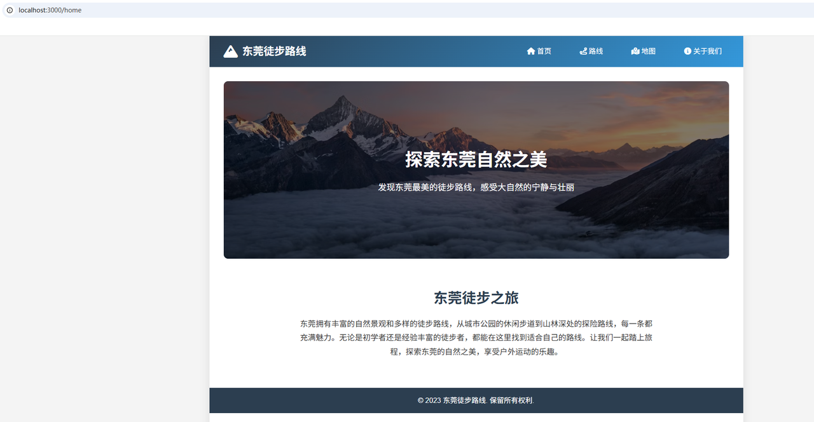
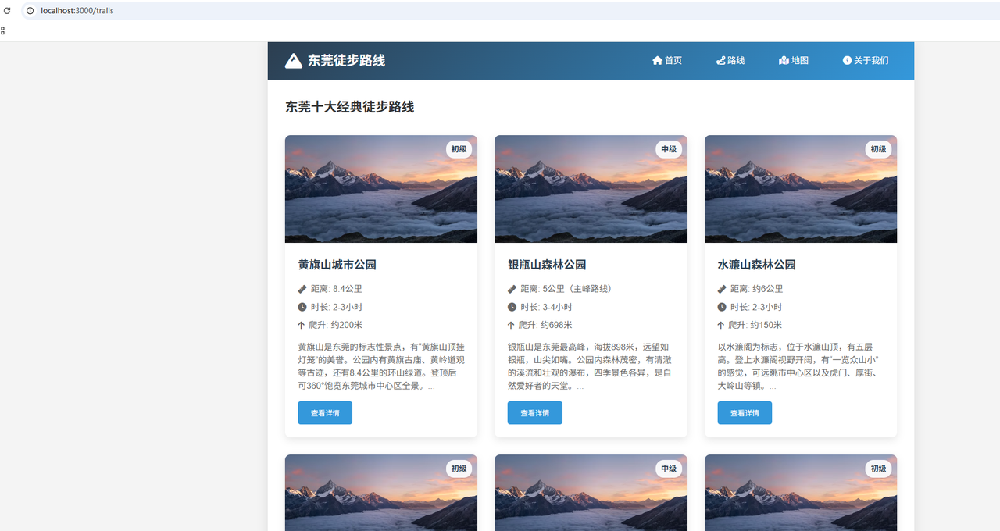
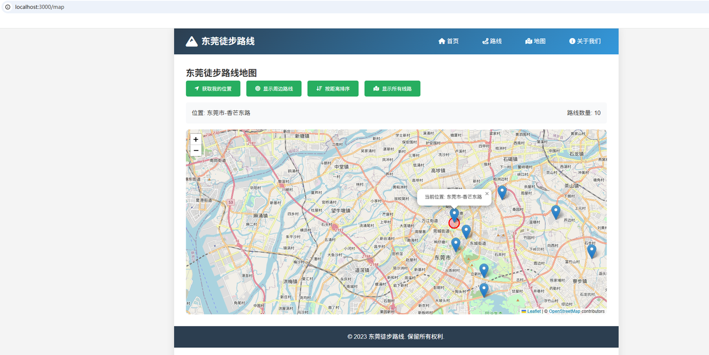
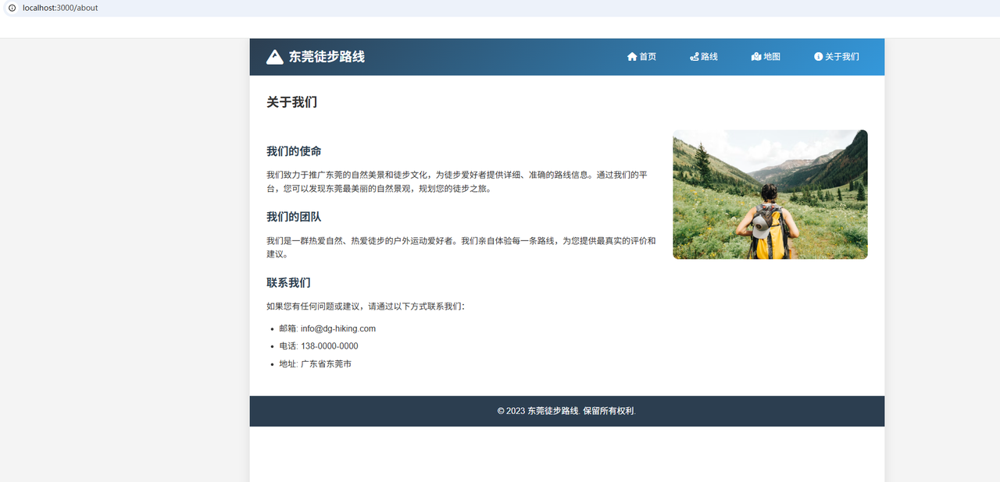

# DevMate 🤖

**AI-Powered Development Assistant (Interview Project)**

## 📌 项目简介

**DevMate** 是一个基于大语言模型（LLM）的智能编程助手，旨在帮助开发者根据自然语言需求：

- 自主搜索网络信息（基于 **Model Context Protocol, MCP**）
- 检索本地知识库（基于 **RAG**）
- 规划并生成真实、可运行的项目代码结构

本项目重点体现以下能力：

- Agent 系统设计
- MCP 工具调用
- RAG（检索增强生成）
- 工程化能力（配置管理、可观测性、Docker 化）

## 🧠 设计原则

本项目在设计上遵循以下原则：

- **关注点分离**：Agent 决策、工具能力、模型调用、I/O 操作严格解耦，便于维护与测试。
- **配置优先**：所有模型、API Key、服务地址均通过环境变量配置，避免硬编码。
- **渐进式交付**：每一个阶段都保证代码结构清晰、可运行、可追溯（Git Commit）。
- **跨平台兼容**：本地开发环境为 Windows，代码实现中统一使用 pathlib，确保在 Linux / Docker 环境中正常运行。
  DevMate 使用 docker-compose 编排以下服务：
  - devmate-app：核心智能体应用
  - mcp-search：基于 MCP 的搜索服务
  - vector-db：RAG 向量数据持久化服务

## 启动

### 系统要求

在运行项目前，请确保您的机器满足以下最低系统要求：

- CPU >= 2 Core
- RAM >= 4 GiB
- docker >= 4.55
- uv >= 0.9.18

## 快速启动

启动服务器的最简单方法是运行[docker-compose.yml](https://github.com/LUOQING1994/devmate/tree/main/docker/docker-compose.yml) 文件。在运行安装命令之前，请确保您的机器上安装了 [Docker](https://docs.docker.com/get-docker/) 和 [Docker Compose](https://docs.docker.com/compose/install/)：

```text
cd docker
cp .env.example .env
docker compose build --no-cache
docker-compose run --rm devmate-app
```

运行后，可以在终端上进行交互。

## DevMate智能体生成网站成果展示
项目位置：根目录\generated_projects\hiking_trails
提示：DevMate智能体每次运行生成的网站风格都略有不同。当前展示只验证DevMate智能体完整的生成结果




## 👈 DevMate智能体流程

```text
👤 用户输入自然语言需求
   ↓
🧭 意图解析 & 任务理解（LLM）
   - 判断是：咨询 / 搜索 / 代码生成 / 项目构建
   - 识别是否需要知识检索或工具调用
   ↓
📚 RAG 本地知识检索（带来源）
   - 从 knowledge_db 中进行向量相似度搜索
   - 返回高相关文档片段（含来源、chunk 信息）
   - 用于补充项目内/内部规范知识
   ↓
🔍 MCP 网页搜索（Tavily Search）
   - 通过 MCP Search Server 调用 Tavily API
   - 获取最新、实时的外部信息
   - 以结构化结果形式返回（title / url / content）
   ↓
🧠 上下文融合与摘要（Context Synthesizer）
   - 合并 RAG 本地知识 + MCP 搜索结果
   - 去重、压缩、重排信息
   - 明确标注信息来源，避免“幻觉”
   ↓
📄 结构化上下文（带来源引用）
   - 统一为 Agent 可消费的上下文结构
   - 作为 System / Tool Context 注入到 LLM Prompt
   ↓
🛠️ 规划（Planning）与工具决策
   - Agent 判断是否需要：
     · 创建项目结构
     · 生成代码文件
     · 修改已有文件
   - 选择合适的 MCP Tool（Filesystem / Search 等）
   ↓
📂 MCP Filesystem 工具调用
   - 创建目录 / 文件
   - 写入或修改多文件代码
   - 所有操作受限于授权目录
   ↓
💬 最终流式回答（Streaming Output）
   - 向用户实时输出结果
   - 同步展示 Agent 的推理与执行过程
   - 提供可直接运行的代码或项目结果
```

## 📂 项目目录结构说明

```text
devmate/
├── README.md
│   └── 项目总体说明文档，介绍 DevMate 的设计目标、核心能力、架构组成、
│       使用方式以及关键技术选型，是面试官了解项目的第一入口。

├── pyproject.toml
│   └── Python 项目配置文件，定义运行环境、依赖库版本及工具链配置，
│       用于保证项目在不同环境下的可复现性。

├── uv.lock
│   └── 依赖锁文件，确保依赖版本一致，避免“在我机器上能跑”的问题。

├── agent
│   ├── __init__.py
│   │   └── Agent 模块初始化文件，标识该目录为 Python 包。
│
│   ├── devMateAgent
│   │   ├── __init__.py
│   │   │   └── DevMate Agent 子模块初始化文件。
│   │
│   │   └── simple_agent.py
│   │       └── DevMate 核心智能体实现：
│   │           - 基于 LangChain / DeepAgent 构建
│   │           - 负责对话理解、规划（Planning）与工具调用
│   │           - 支持流式输出与多轮上下文记忆
│
│   └── prompts
│       ├── __init__.py
│       │   └── Prompt 模块初始化文件。
│       │
│       └── program_prompt.txt
│           └── 智能体系统提示词（System Prompt）：
│               - 定义 Agent 的角色、行为边界与能力描述
│               - 是 Agent 行为一致性的核心配置文件

├── docker
│   ├── docker-compose.yml
│   │       └── 编排服务 (App + Vector DB + MCP Server)
│   └── Dockerfile
│           └── 构建 DevMate 应用镜像。

├── images
│   └── 示例图片

├── generated_projects
│   ├── hiking_trails
│   │       └── DevMate 生成的网站代码（可运行）


├── knowledge_db
│   ├── docs
│   │   └── internal_fastapi_guidelines.md
│   │       └── 本地知识库原始文档：
│   │           - 用于 RAG 检索的数据来源
│   │           - 支持 Markdown / Text 格式
│
│   └── rag
│       ├── __init__.py
│       │   └── RAG 模块初始化文件。
│       │
│       ├── ingest.py
│       │   └── 知识库摄入模块：
│       │       - 负责解析本地文档
│       │       - 文本切分、向量化并写入向量数据库（FAISS）
│
│       └── retriever.py
│           └── RAG 检索模块：
│               - 根据用户问题进行相似度搜索
│               - 返回相关上下文供 Agent 合成回答

├── log
│   ├── __init__.py
│   │   └── 日志模块初始化文件。
│
│   └── logging_config.py
│       └── 全局日志配置：
│           - 统一日志格式
│           - 支持彩色输出与不同日志级别
│           - 便于调试与生产环境观察

├── mcp_server
│   ├── __init__.py
│   │   └── MCP 服务模块初始化文件。
│
│   ├── TavilyMcpServer.py
│   │   └── MCP Search Server 实现：
│   │       - 基于 MCP 协议对外暴露 search_web 工具
│   │       - 内部使用 Tavily 搜索 API
│   │       - 支持 Agent 通过 MCP 进行联网信息检索
│
│   ├── McpClient.py
│   │   └── MCP Client 管理器：
│   │       - 统一管理多个 MCP Server（搜索 / 文件系统等）
│   │       - 负责工具发现、生命周期管理与安全边界控制
│
│   └── client_test.py
│       └── 早期 MCP Client 实验代码或历史实现，保留用于参考与对比。

├── utils
│   ├── __init__.py
│   │   └── 工具模块初始化文件。
│
│   ├── load_prompt.py
│   │   └── Prompt 加载与项目根目录定位工具：
│   │       - 动态查找项目根目录
│   │       - 避免硬编码路径，提升工程稳定性
│
│   └── search_knowledge.py
│       └── 本地 RAG 查询工具：
│           - 封装为 Agent 可调用的 Tool
│           - 用于从本地知识库中召回相关内容

├── word
│   ├── checklist.md
│   │   └── 面试题验收清单，对照功能点进行自检。
│
│   ├── requirements.md
│   │   └── 面试题需求说明文档，定义项目目标与约束条件。
│
│   └── 徒步网站截图.png
│       └── 生成项目的示例截图或需求参考图片。

├── simple_mcp_angent.py
│   └── 项目主运行入口：
│       - 初始化 MCP Client
│       - 组装 Agent 工具链
│       - 启动 DevMate 并进入交互式对话循环
```

## 🧭 DevMate 项目研发迭代计划

---

### ✅ **Iteration 1：项目骨架与工程规范搭建**

**目标：建立可长期演进的工程基础**

- 初始化标准 Python 项目结构（`pyproject.toml`）
- 明确模块边界（Agent / MCP / RAG / Utils / Logs）
- 建立统一日志体系（彩色日志 + 日志级别控制）
- 实现 Prompt 管理与项目根路径自动定位机制
- 接入Lang Simith 可视化管理

> 🔎 **价值**：确保项目具备良好的可维护性、可扩展性与工程一致性

---

### ✅ **Iteration 2：MCP Server + 实时网络搜索能力**

**目标：让 Agent 具备“连接真实世界”的能力**

- 实现 MCP Search Server（基于 Tavily）
- 通过 MCP 协议为 Agent 提供联网搜索能力
- 为防止搜索结果导致 Token 不可控：
  - 单独实现 **查询内容摘要总结 Agent**
  - 对搜索结果进行压缩、去噪与结构化

> 🔎 **价值**：兼顾信息实时性与推理成本可控性

---

### ✅ **Iteration 3：RAG 本地知识库检索能力**

**目标：构建稳定、可追溯的本地知识体系**

- 构建完整 RAG 流程：
  - 本地文档摄入（Markdown / Text）
  - 文本切分与向量化
  - FAISS 本地向量数据库
- 针对本地 RAG 数据与联网搜索数据：
  - 构建统一的 **上下文融合与摘要 Agent**
  - 去除重复、解决冲突、提升信息质量
  - 输出结构化、**带来源标注**的上下文信息

> 🔎 **价值**：提升回答稳定性、可信度与可解释性

---

### ✅ **Iteration 4：多文件项目生成与代码修改能力**

**目标：从“回答问题”进化为“交付代码”**

- 支持 Agent 生成完整的多文件项目结构
- 能够自动：
  - 创建目录与文件
  - 编写可运行的代码
- 集成 **Filesystem MCP**：
  - 所有文件操作严格受限于授权目录
  - 确保代码生成过程安全、可审计
- 支持根据用户反馈对已有文件进行修改与迭代

> 🔎 **价值**：使 DevMate 具备真实“开发助理”级能力

---

### ✅**Iteration 5：系统级整合与工程化验证**

**目标：验证 DevMate 的工程级可用性与交付能力**

- Docker 化部署：
  - Agent 服务
  - MCP Server
- 编写端到端使用示例：
  - 从自然语言需求
  - 到生成完整可运行项目
- 完善 README：
  - 架构设计说明
  - 安全边界与工具权限说明
  - 使用与部署指南

> 🔎 **价值**：从面试项目升级为可部署、可演示的完整系统
